# Lifespan System Ontology - Mermaid Diagram

## Entity Relationship Diagram

```mermaid
erDiagram
    %% Core Span Types
    PERSON {
        uuid id PK
        string name
        string type_id "person"
        int start_year "birth year"
        int end_year "death year"
        jsonb metadata
        string access_level
    }
    
    ORGANISATION {
        uuid id PK
        string name
        string type_id "organisation"
        int start_year "founding year"
        int end_year "dissolution year"
        jsonb metadata
        string access_level
    }
    
    PLACE {
        uuid id PK
        string name
        string type_id "place"
        int start_year "establishment year"
        int end_year "closure year"
        jsonb metadata
        string access_level
    }
    
    EVENT {
        uuid id PK
        string name
        string type_id "event"
        int start_year "start year"
        int end_year "end year"
        jsonb metadata
        string access_level
    }
    
    THING {
        uuid id PK
        string name
        string type_id "thing"
        int start_year "creation year"
        int end_year "destruction year"
        jsonb metadata
        string access_level
    }
    
    BAND {
        uuid id PK
        string name
        string type_id "band"
        int start_year "formation year"
        int end_year "disbandment year"
        jsonb metadata
        string access_level
    }
    
    SET {
        uuid id PK
        string name
        string type_id "set"
        jsonb metadata
        string access_level
        boolean timeless
    }
    
    ROLE {
        uuid id PK
        string name
        string type_id "role"
        jsonb metadata
        string access_level
    }
    
    CONNECTION_SPAN {
        uuid id PK
        string name
        string type_id "connection"
        int start_year "relationship start"
        int end_year "relationship end"
        jsonb metadata
        string access_level
    }
    
    %% Connection Types (Relationships)
    CONNECTION {
        uuid id PK
        uuid parent_id FK "subject"
        uuid child_id FK "object"
        string type_id FK "connection type"
        uuid connection_span_id FK "temporal data"
    }
    
    CONNECTION_TYPE {
        string type PK
        string forward_predicate
        string inverse_predicate
        json allowed_span_types
        string constraint_type
    }
    
    %% User and Access Control
    USER {
        uuid id PK
        string email
        uuid personal_span_id FK
        boolean is_admin
    }
    
    USER_SPAN {
        uuid id PK
        uuid user_id FK
        uuid span_id FK
        string access_level
    }
    
    %% Hierarchical Relationships
    SPAN_HIERARCHY {
        uuid id PK
        uuid parent_id FK "parent span"
        uuid root_id FK "root span"
    }
    
    %% Relationships between entities
    PERSON ||--o{ CONNECTION : "subject"
    PERSON ||--o{ CONNECTION : "object"
    ORGANISATION ||--o{ CONNECTION : "subject"
    ORGANISATION ||--o{ CONNECTION : "object"
    PLACE ||--o{ CONNECTION : "subject"
    PLACE ||--o{ CONNECTION : "object"
    EVENT ||--o{ CONNECTION : "subject"
    EVENT ||--o{ CONNECTION : "object"
    THING ||--o{ CONNECTION : "subject"
    THING ||--o{ CONNECTION : "object"
    BAND ||--o{ CONNECTION : "subject"
    BAND ||--o{ CONNECTION : "object"
    SET ||--o{ CONNECTION : "subject"
    ROLE ||--o{ CONNECTION : "object"
    CONNECTION_SPAN ||--o{ CONNECTION : "temporal_data"
    
    CONNECTION ||--|| CONNECTION_TYPE : "type"
    CONNECTION ||--|| CONNECTION_SPAN : "span"
    
    USER ||--o{ USER_SPAN : "access"
    USER ||--|| PERSON : "personal_span"
    
    %% Self-referential relationships for hierarchy
    PERSON ||--o{ SPAN_HIERARCHY : "parent"
    PERSON ||--o{ SPAN_HIERARCHY : "child"
    ORGANISATION ||--o{ SPAN_HIERARCHY : "parent"
    ORGANISATION ||--o{ SPAN_HIERARCHY : "child"
    PLACE ||--o{ SPAN_HIERARCHY : "parent"
    PLACE ||--o{ SPAN_HIERARCHY : "child"
    EVENT ||--o{ SPAN_HIERARCHY : "parent"
    EVENT ||--o{ SPAN_HIERARCHY : "child"
    THING ||--o{ SPAN_HIERARCHY : "parent"
    THING ||--o{ SPAN_HIERARCHY : "child"
    BAND ||--o{ SPAN_HIERARCHY : "parent"
    BAND ||--o{ SPAN_HIERARCHY : "child"
    SET ||--o{ SPAN_HIERARCHY : "parent"
    SET ||--o{ SPAN_HIERARCHY : "child"
    ROLE ||--o{ SPAN_HIERARCHY : "parent"
    ROLE ||--o{ SPAN_HIERARCHY : "child"
    CONNECTION_SPAN ||--o{ SPAN_HIERARCHY : "parent"
    CONNECTION_SPAN ||--o{ SPAN_HIERARCHY : "child"
```



## Relationship Flow Diagram

```mermaid
graph TB
    %% Span Types
    subgraph "Core Entities"
        PERSON[👤 Person]
        ORGANISATION[🏢 Organisation]
        PLACE[📍 Place]
        EVENT[🎉 Event]
        THING[📦 Thing]
        BAND[🎵 Band]
        SET[📚 Set]
        ROLE[🎭 Role]
        CONNECTION_SPAN[🔗 Connection Span]
    end
    
    %% Connection Types with Labels
    subgraph "Connection Types"
        FAMILY[👨‍👩‍👧‍👦 Family]
        RELATIONSHIP[💕 Relationship]
        FRIEND[🤝 Friend]
        EMPLOYMENT[💼 Employment]
        EDUCATION[🎓 Education]
        MEMBERSHIP[👥 Membership]
        RESIDENCE[🏠 Residence]
        TRAVEL[✈️ Travel]
        OWNERSHIP[💎 Ownership]
        PARTICIPATION[🎪 Participation]
        HAS_ROLE[🎭 Has Role]
        HAS_SET[📚 Has Set]
        CREATED[🎨 Created]
        LOCATED[📍 Located]
        CONTAINS[📦 Contains]
        AT_ORGANISATION[🏢 At Organisation]
        DURING[⏰ During]
    end
    
    %% Person Relationships
    PERSON -->|family| PERSON
    PERSON -->|relationship| PERSON
    PERSON -->|friend| PERSON
    PERSON -->|employment| ORGANISATION
    PERSON -->|education| ORGANISATION
    PERSON -->|membership| ORGANISATION
    PERSON -->|membership| BAND
    PERSON -->|residence| PLACE
    PERSON -->|travel| PLACE
    PERSON -->|ownership| THING
    PERSON -->|participation| EVENT
    PERSON -->|has_role| ROLE
    PERSON -->|has_set| SET
    PERSON -->|created| THING
    
    %% Organisation Relationships
    ORGANISATION -->|participation| EVENT
    ORGANISATION -->|located| PLACE
    
    %% Place Relationships
    PLACE -->|located| PLACE
    
    %% Event Relationships
    EVENT -->|located| PLACE
    
    %% Thing Relationships
    THING -->|contains| THING
    
    %% Role Relationships
    ROLE -->|at_organisation| ORGANISATION
    
    %% Connection Span Relationships
    CONNECTION_SPAN -->|during| CONNECTION_SPAN
    
    %% Set Relationships
    SET -->|contains| PERSON
    SET -->|contains| THING
    SET -->|contains| CONNECTION_SPAN
    
    %% Styling
    classDef personClass fill:#e1f5fe
    classDef orgClass fill:#f3e5f5
    classDef placeClass fill:#e8f5e8
    classDef eventClass fill:#fff3e0
    classDef thingClass fill:#fce4ec
    classDef bandClass fill:#f1f8e9
    classDef setClass fill:#e0f2f1
    classDef roleClass fill:#fafafa
    classDef connectionClass fill:#fff8e1
    
    class PERSON personClass
    class ORGANISATION orgClass
    class PLACE placeClass
    class EVENT eventClass
    class THING thingClass
    class BAND bandClass
    class SET setClass
    class ROLE roleClass
    class CONNECTION_SPAN connectionClass
```



## Temporal Relationship Diagram


## Access Control Flow


## Connection Constraint Types

```mermaid
graph LR
    subgraph "Single Constraint"
        S1[Person A] -->|family| S2[Person B]
        S3[Person A] -->|employment| S4[Organisation X]
        style S1 fill:#e1f5fe
        style S2 fill:#e1f5fe
        style S3 fill:#e1f5fe
        style S4 fill:#f3e5f5
    end
    
    subgraph "Non-overlapping Constraint"
        N1[Person A] -->|residence 1960-1970| N2[Place X]
        N3[Person A] -->|residence 1975-1985| N4[Place Y]
        N5[Person A] -->|education 1955-1965| N6[University Z]
        style N1 fill:#e1f5fe
        style N2 fill:#e8f5e8
        style N3 fill:#e1f5fe
        style N4 fill:#e8f5e8
        style N5 fill:#e1f5fe
        style N6 fill:#f3e5f5
    end
    
    subgraph "No Constraint"
        C1[Person A] -->|friend| C2[Person B]
        C3[Person A] -->|friend| C4[Person C]
        C5[Person A] -->|friend| C6[Person D]
        style C1 fill:#e1f5fe
        style C2 fill:#e1f5fe
        style C3 fill:#e1f5fe
        style C4 fill:#e1f5fe
        style C5 fill:#e1f5fe
        style C6 fill:#e1f5fe
```

## Set Collection Pattern

```mermaid
graph TB
    subgraph "Set: My Favourite Albums"
        SET[📚 My Favourite Albums]
        
        subgraph "Album Spans"
            ALBUM1[💿 Abbey Road]
            ALBUM2[💿 Sgt. Pepper]
            ALBUM3[💿 Dark Side of the Moon]
        end
        
        subgraph "Connection Spans"
            CONN1[🔗 Contains Abbey Road]
            CONN2[🔗 Contains Sgt. Pepper]
            CONN3[🔗 Contains Dark Side]
        end
    end
    
    SET -->|contains| ALBUM1
    SET -->|contains| ALBUM2
    SET -->|contains| ALBUM3
    
    CONN1 -.->|connection_span| ALBUM1
    CONN2 -.->|connection_span| ALBUM2
    CONN3 -.->|connection_span| ALBUM3
    
    style SET fill:#e0f2f1
    style ALBUM1 fill:#fce4ec
    style ALBUM2 fill:#fce4ec
    style ALBUM3 fill:#fce4ec
    style CONN1 fill:#fff8e1
    style CONN2 fill:#fff8e1
    style CONN3 fill:#fff8e1
```



## Role Pattern Example

```mermaid
graph LR
    subgraph "Role Pattern"
        PERSON[👤 John Lennon]
        ROLE[🎭 Lead Singer]
        BAND[🎵 The Beatles]
        
        PERSON -->|has_role| ROLE
        ROLE -->|at_organisation| BAND
    end
    
    subgraph "Temporal Data"
        CONN1[🔗 John Lennon has Lead Singer role]
        CONN2[🔗 Lead Singer role at The Beatles]
        
        CONN1 -.->|1960-1970| ROLE
        CONN2 -.->|1960-1970| BAND
    end
    
    style PERSON fill:#e1f5fe
    style ROLE fill:#fafafa
    style BAND fill:#f1f8e9
    style CONN1 fill:#fff8e1
    style CONN2 fill:#fff8e1
```



## Versioning System


## Materialized View Structure

```mermaid
graph TB
    subgraph "Materialized View: span_connections"
        MV[span_connections<br/>Materialized View]
        
        subgraph "JSON Structure"
            JSON[{
                "span_id": "uuid",
                "connections": [
                    {
                        "id": "conn_uuid",
                        "type": "family",
                        "connected_span_id": "uuid",
                        "role": "parent|child",
                        "connection_span_id": "uuid",
                        "metadata": {}
                    }
                ]
            }]
        end
    end
    
    subgraph "Source Tables"
        SPANS[spans]
        CONNECTIONS[connections]
        CONNECTION_TYPES[connection_types]
    end
    
    SPANS -->|LEFT JOIN| MV
    CONNECTIONS -->|LEFT JOIN| MV
    CONNECTION_TYPES -->|LEFT JOIN| MV
    
    MV -.->|JSON aggregation| JSON
    
    style MV fill:#e0f2f1
    style JSON fill:#f3e5f5
    style SPANS fill:#e8f5e8
    style CONNECTIONS fill:#fff3e0
    style CONNECTION_TYPES fill:#fce4ec
```

## Summary

This Mermaid diagram collection shows:

1. **Entity Relationship Diagram**: Complete database schema with all tables and relationships
2. **Relationship Flow**: Visual representation of how different span types connect
3. **Temporal Relationships**: How time affects relationships and constraints
4. **Access Control**: Permission flow and security model
5. **Constraint Types**: Different relationship constraint patterns
6. **Set Collections**: How sets organize spans and connections
7. **Role Patterns**: Complex relationship patterns with roles
8. **Versioning**: How changes are tracked over time
9. **Performance**: Materialized view optimization

The diagrams demonstrate how the Lifespan system creates a sophisticated temporal knowledge graph that can handle complex queries about relationships, time periods, and entity interactions. 